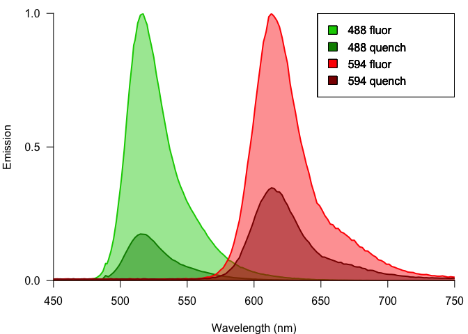
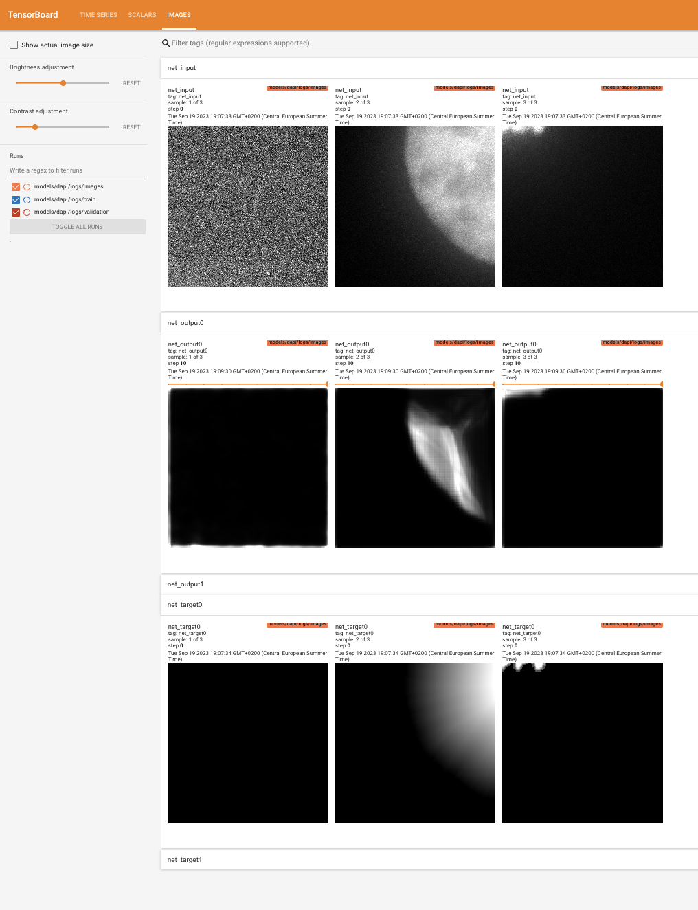
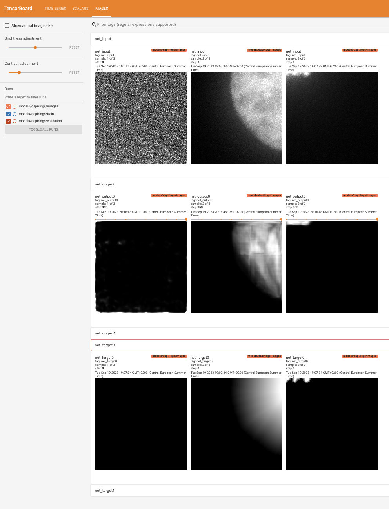
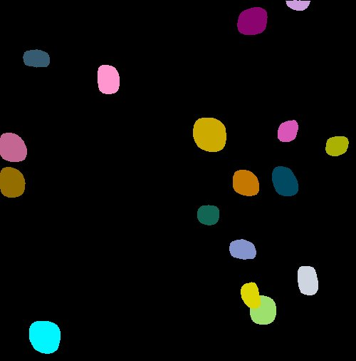

# figure01
Daniel Fürth <br><br>Table of Contents:

- [Emission plot Fig. 1c](#emission-plot-fig.-1c)
- [DAPI nuclei cell segmentation in
  2D.](#dapi-nuclei-cell-segmentation-in-2d.)
  - [Installation](#installation)
  - [Segmentation training](#segmentation-training)
  - [Prediction](#prediction)

## Emission plot Fig. 1c

``` r
files<-dir('data/spectra/emission', full.names = TRUE)

spectra<-read.table(files[1], sep='\t')
spectra$sample <- 1

for(i in seq_along(files)[-1]){
  spectra.tmp <-read.table(files[i], sep='\t')
  spectra.tmp$sample <- i
  spectra <- rbind(spectra, spectra.tmp)
}
```

``` r
spectra$fluor <- NA

spectra$fluor[spectra$sample %in% seq(9,17)] <- 594
spectra$fluor[!(spectra$sample %in% seq(9,17))] <- 488

spectra$status <- NA

status<-c('fluor', 'quench', 'fluor',
          'quench', 'quench', 'unquench',
          'unquench', 'unquench', 'unquench',
          'fluor', 'fluor', 'fluor',
          'quench', 'quench', 'quench',
          'unquench', 'unquench', 'unquench')
k<-1
for(i in unique(spectra$sample)){
  
  
  spectra$status[spectra$sample==i]<-status[i]

}


library(dplyr)
```


    Attaching package: 'dplyr'

    The following objects are masked from 'package:stats':

        filter, lag

    The following objects are masked from 'package:base':

        intersect, setdiff, setequal, union

``` r
spec<- spectra %>% 
  group_by(fluor, status, V3) %>% 
  summarise(emission=mean(V4))
```

    `summarise()` has grouped output by 'fluor', 'status'. You can override using
    the `.groups` argument.

``` r
spec$emission[spec$fluor == 488]<-spec$emission[spec$fluor == 488]/max(spec$emission[spec$fluor == 488 & spec$status == 'fluor'])
spec$emission[spec$fluor == 594]<-spec$emission[spec$fluor == 594]/max(spec$emission[spec$fluor == 594 & spec$status == 'fluor'])

spec$emission <- spec$emission - mean(spec$emission[1:50])


col2hex <- function(cname)
{
  colMat <- col2rgb(cname)
  rgb(
    red=colMat[1,]/255,
    green=colMat[2,]/255,
    blue=colMat[3,]/255
  )
}

spec<- spec[-which(spec$status == 'unquench'),]

quartz(width = 130.1729/20, height = 83.8626/20)
par(yaxs='i', xaxs='i', mar=c(4,4,1,1))
plot(0,0, type='n', xlim=c(450,750), ylim=c(0,1), ylab='Emission', xlab="Wavelength (nm)", las=1, axes=F)
axis(2, las=1, at=c(0,0.5,1))

color <- c('green3', 'green4', 'red', 'red4')
unique_samples <- unique( paste(spec$fluor, spec$status) )
names(spec)<-c("fluor" ,   "status" ,  "wavelength"     ,  "emission")

peak.max <- numeric()
# Loop through each unique sample and create a polygon plot
for (sample_name in unique_samples) {
  # Subset the data for the current sample
  sample_data <- spec[paste(spec$fluor, spec$status) == sample_name, ]
  
  # Create a polygon plot for the current sample
  polygon(c(sample_data$wavelength, 
            sample_data$wavelength[nrow(sample_data)], 
            sample_data$wavelength[1],
            sample_data$wavelength[1]), 
          
          c(sample_data$emission, 0, 0, sample_data$emission[1]), 
          col = paste0( col2hex( color[match(sample_name, unique_samples)] ), '70' ),
          border = color[match(sample_name, unique_samples)], lwd=2, xpd=F )
  
  # Add a legend for sample names
  legend("topright", legend = unique_samples, fill = color)
  
  peak.max <- c(peak.max, sample_data$wavelength[which.max(sample_data$emission)] )
}

axis(1, at=seq(300,800,by=50))
```



Save the plot.

``` r
quartz.save(file="pdf/figure01_c.pdf", type='pdf')
```

    quartz_off_screen 
                    2 

Then compute quench ratio:

``` r
quench.ratio <- spec %>% group_by(fluor, status) %>% summarise(max(emission))
```

    `summarise()` has grouped output by 'fluor'. You can override using the
    `.groups` argument.

``` r
AZdye488<-quench.ratio$`max(emission)`[1]/quench.ratio$`max(emission)`[2]

AZdye594<-quench.ratio$`max(emission)`[3]/quench.ratio$`max(emission)`[4]

round(AZdye488, 2)
```

    [1] 5.74

``` r
round(AZdye594, 2)
```

    [1] 2.88

## DAPI nuclei cell segmentation in 2D.

### Installation

Make sure you have `conda` installed. Create a new conda environment:

```
conda create --name cellseg2D-env
conda activate cellseg2D-env
conda install -c conda-forge napari   
conda install opencv
```

Install Tensorflow for macOS M1/M2:

```
pip install tensorflow-macos
pip install tensorflow-metal
```

Install stardist for cell nuclei segmentation:

```
pip install gputools
pip install stardist
pip install csbdeep
```

### Segmentation training

#### Augment training data set

```
python augment.py
```

This expands images_org and masks_org into images (input) and masks
(ground truth). Input and ground truth are matched based on file name.
Format is 8-bit monochrome TIF on both.

If more than 255 cells needs to be segmented within a single image you
can simply change mask format to 16-bit.

#### Perform training

```
python train_nuclei.py
```

Open up tensorboard to follow the results:

```
tensorboard --logdir=.
```


Click the **images** tab of the Tensorboard to inspect the visual output
of the training.

<div id="fig-training">

<table style="width:50%;">
<colgroup>
<col style="width: 50%" />
</colgroup>
<tbody>
<tr class="odd">
<td style="text-align: center;"><div width="50.0%"
data-layout-align="center">
<p> </p>
</div></td>
</tr>
</tbody>
</table>

Figure 1: Training monitoring. Left is in the beginning right is later
during training. Top row is input, middle is output of network and
bottom is the reference (what the network should aim for).

</div>

In detail:

- `net_input` is the input images. Notice a cell is only really present
  in the first out of three.
- `net_output0` is the current output from the network.
- `net_target0` is the ground truth (what the network ideally should
  have generated).

### Prediction

We have a script we can apply to any image for prediction.

```
python predict_nuclei.py 
```

<div id="fig-dapi">

<table>
<colgroup>
<col style="width: 50%" />
<col style="width: 50%" />
</colgroup>
<tbody>
<tr class="odd">
<td style="text-align: center;"><div width="50.0%"
data-layout-align="center">
<p></p>
</div></td>
<td style="text-align: center;"><div width="50.0%"
data-layout-align="center">
<p></p>
</div></td>
</tr>
</tbody>
</table>

Figure 2: Segmentation results.

</div>
