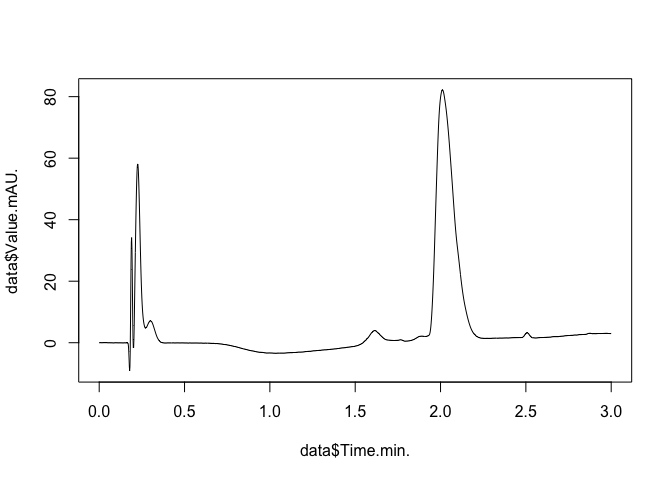

# supplementary_fig02
Daniel Fürth

## Create a table of raw data files

The raw data text files are in the folder `./data/lc/`. Lets list the
content of that folder:

``` r
folder <- './data/lc'
files <- dir(folder)
files
```

     [1] "Azido_PEG_tetrazine_chromatogram_280nm.txt"
     [2] "Azido_PEG_tetrazine_MS.txt"                
     [3] "DBCO488_chromatogram_280nm.txt"            
     [4] "DBCO488_MS.txt"                            
     [5] "DBCO594_chromatogram_280nm.txt"            
     [6] "DBCO594_MS.txt"                            
     [7] "RXN488_chromatogram_280nm.txt"             
     [8] "RXN488_MS.txt"                             
     [9] "RXN594_chromatogram_280nm.txt"             
    [10] "RXN594_MS.txt"                             

We have two types of files: `MS` and `chromatogram`. Lets check the
presence of string `MS` and `chromatogram` in the filenames using
`grepl()` command and make a boolean index based on it:

``` r
ms <- grepl("MS", files)
chromatogram <- grepl("chromatogram", files)
```

Lets make a data frame object, `myfiles`, that stores all info about our
files including the full file path:

``` r
myfiles<-data.frame(folder, files, ms, chromatogram)
#show the data frame in console
myfiles
```

          folder                                      files    ms chromatogram
    1  ./data/lc Azido_PEG_tetrazine_chromatogram_280nm.txt FALSE         TRUE
    2  ./data/lc                 Azido_PEG_tetrazine_MS.txt  TRUE        FALSE
    3  ./data/lc             DBCO488_chromatogram_280nm.txt FALSE         TRUE
    4  ./data/lc                             DBCO488_MS.txt  TRUE        FALSE
    5  ./data/lc             DBCO594_chromatogram_280nm.txt FALSE         TRUE
    6  ./data/lc                             DBCO594_MS.txt  TRUE        FALSE
    7  ./data/lc              RXN488_chromatogram_280nm.txt FALSE         TRUE
    8  ./data/lc                              RXN488_MS.txt  TRUE        FALSE
    9  ./data/lc              RXN594_chromatogram_280nm.txt FALSE         TRUE
    10 ./data/lc                              RXN594_MS.txt  TRUE        FALSE

``` r
#get the names of the the variables
names(myfiles)
```

    [1] "folder"       "files"        "ms"           "chromatogram"

add full file paths:

``` r
myfiles$path<-dir(folder, full.names=TRUE)
#get the names of the the variables
names(myfiles)
```

    [1] "folder"       "files"        "ms"           "chromatogram" "path"        

## Import the data

Next lets import a chromatogram file. We can open the file manually and
find that on line 76 we have the text `Raw data:` followed by the data
in TSV format.

    76    Raw Data:
    77    Time(min) Step(sec)   Value(mAU)
    78    0.000000  0.00    0.000000    
    79    0.001667  0.10    0.000030    
    80    0.003333  0.10    0.000580    
    81    0.005000  0.10    0.002410    

We can simply then import the data into a data frame by adding
`skip = 76` and the `read.table()`command will skip all the line suntil
line 77. If we also add `header=TRUE` we will import the variable names
into the header of the data frame.

``` r
data<-read.table(myfiles$path[1], skip=76, header=TRUE)
head(data) #just show the first 6 lines of the table, tail() command shows the last 6 lines.
```

      Time.min. Step.sec. Value.mAU.
    1  0.000000       0.0    0.00000
    2  0.001667       0.1    0.00003
    3  0.003333       0.1    0.00058
    4  0.005000       0.1    0.00241
    5  0.006667       0.1    0.00534
    6  0.008333       0.1    0.00690

Lets plot the chromatogram as a line plot:

``` r
plot(data$Time.min., data$Value.mAU., type='l')
```



# Make a master data frame with all data.

Lets examine the different files we have from the chromatogram:

``` r
myfiles[myfiles$chromatogram,]
```

         folder                                      files    ms chromatogram
    1 ./data/lc Azido_PEG_tetrazine_chromatogram_280nm.txt FALSE         TRUE
    3 ./data/lc             DBCO488_chromatogram_280nm.txt FALSE         TRUE
    5 ./data/lc             DBCO594_chromatogram_280nm.txt FALSE         TRUE
    7 ./data/lc              RXN488_chromatogram_280nm.txt FALSE         TRUE
    9 ./data/lc              RXN594_chromatogram_280nm.txt FALSE         TRUE
                                                      path
    1 ./data/lc/Azido_PEG_tetrazine_chromatogram_280nm.txt
    3             ./data/lc/DBCO488_chromatogram_280nm.txt
    5             ./data/lc/DBCO594_chromatogram_280nm.txt
    7              ./data/lc/RXN488_chromatogram_280nm.txt
    9              ./data/lc/RXN594_chromatogram_280nm.txt

We can see that the sample name preceeds the first `_` in the file name
so lets add a variable `sample` with that text string:

``` r
#split the string by _ character
underscore_split<-strsplit( myfiles$files, "_")
underscore_split
```

    [[1]]
    [1] "Azido"        "PEG"          "tetrazine"    "chromatogram" "280nm.txt"   

    [[2]]
    [1] "Azido"     "PEG"       "tetrazine" "MS.txt"   

    [[3]]
    [1] "DBCO488"      "chromatogram" "280nm.txt"   

    [[4]]
    [1] "DBCO488" "MS.txt" 

    [[5]]
    [1] "DBCO594"      "chromatogram" "280nm.txt"   

    [[6]]
    [1] "DBCO594" "MS.txt" 

    [[7]]
    [1] "RXN488"       "chromatogram" "280nm.txt"   

    [[8]]
    [1] "RXN488" "MS.txt"

    [[9]]
    [1] "RXN594"       "chromatogram" "280nm.txt"   

    [[10]]
    [1] "RXN594" "MS.txt"

Here `underscore_split` is a list object where each file name is an
entry in the list and it then has a nested list within where text
between each “\_” is entered as a single entry. We can then extract the
first entry from each list using `lapply()`“list apply” function:

``` r
# Create a new list 'sample.name' by applying a function to each element of 'underscore_split'
sample.name <- lapply(underscore_split, function(x) {
  return(x[1])  # Return the first element (index 1) of each element in 'underscore_split'
})

# Display the resulting 'sample.name' list
sample.name
```

    [[1]]
    [1] "Azido"

    [[2]]
    [1] "Azido"

    [[3]]
    [1] "DBCO488"

    [[4]]
    [1] "DBCO488"

    [[5]]
    [1] "DBCO594"

    [[6]]
    [1] "DBCO594"

    [[7]]
    [1] "RXN488"

    [[8]]
    [1] "RXN488"

    [[9]]
    [1] "RXN594"

    [[10]]
    [1] "RXN594"

``` r
# Check class of the object
class(sample.name)
```

    [1] "list"

Here `sample.name`is a object with the class list. If we now want to go
from list object to a character vector to insert it into our data frame
we can do like this:

``` r
myfiles$sample<-unlist(sample.name)
myfiles
```

          folder                                      files    ms chromatogram
    1  ./data/lc Azido_PEG_tetrazine_chromatogram_280nm.txt FALSE         TRUE
    2  ./data/lc                 Azido_PEG_tetrazine_MS.txt  TRUE        FALSE
    3  ./data/lc             DBCO488_chromatogram_280nm.txt FALSE         TRUE
    4  ./data/lc                             DBCO488_MS.txt  TRUE        FALSE
    5  ./data/lc             DBCO594_chromatogram_280nm.txt FALSE         TRUE
    6  ./data/lc                             DBCO594_MS.txt  TRUE        FALSE
    7  ./data/lc              RXN488_chromatogram_280nm.txt FALSE         TRUE
    8  ./data/lc                              RXN488_MS.txt  TRUE        FALSE
    9  ./data/lc              RXN594_chromatogram_280nm.txt FALSE         TRUE
    10 ./data/lc                              RXN594_MS.txt  TRUE        FALSE
                                                       path  sample
    1  ./data/lc/Azido_PEG_tetrazine_chromatogram_280nm.txt   Azido
    2                  ./data/lc/Azido_PEG_tetrazine_MS.txt   Azido
    3              ./data/lc/DBCO488_chromatogram_280nm.txt DBCO488
    4                              ./data/lc/DBCO488_MS.txt DBCO488
    5              ./data/lc/DBCO594_chromatogram_280nm.txt DBCO594
    6                              ./data/lc/DBCO594_MS.txt DBCO594
    7               ./data/lc/RXN488_chromatogram_280nm.txt  RXN488
    8                               ./data/lc/RXN488_MS.txt  RXN488
    9               ./data/lc/RXN594_chromatogram_280nm.txt  RXN594
    10                              ./data/lc/RXN594_MS.txt  RXN594

You can see how we now have a variable `myfiles$sample` with all the
sample names:

``` r
myfiles$sample
```

     [1] "Azido"   "Azido"   "DBCO488" "DBCO488" "DBCO594" "DBCO594" "RXN488" 
     [8] "RXN488"  "RXN594"  "RXN594" 

Some stats, showing that each sample has two files (one `MS` and one
`chromatogram`):

``` r
table(myfiles$sample)
```


      Azido DBCO488 DBCO594  RXN488  RXN594 
          2       2       2       2       2 

Lets create a new data frame called `trace` where we have all the traces
from each experiment into one file:

``` r
#create an empty data frame where we will store our data
trace<-data.frame(sample = character(), time = numeric(), value = numeric())

#loop through each chromatogram file and load it in and add it to trace data frame
for(i in which(myfiles$chromatogram)){
  tmp<-read.table(myfiles$path[i], skip=76, header=TRUE)
  
  trace.tmp<-data.frame(
                        sample = myfiles$sample[i], 
                        time = tmp$Time.min, 
                        value = tmp$Value.mAU
                        )
  
  #add the just loaded file into master data frame, trace
  trace <- rbind(trace, trace.tmp)
}
```

Lets check the new data frame `trace`:

``` r
table(trace$sample)
```


      Azido DBCO488 DBCO594  RXN488  RXN594 
       1801    1801    1801    1801    1801 

So we have each sample loaded with 1801 measurements in each.

# Make a plot

``` r
mysamples<- rev(unique(trace$sample)) #reverse order because we want reactions RXN at bottom so one reads the graph top to bottom.

scale.factor.y <- 1.2 #adds some space between lines when we stack them on top. 
text.under.y <- 0.2 #placement of the text label under the trace. 
text.under.x <- 0.1 #placement of the text label under the trace. 


plot(trace$time[trace$sample == mysamples[1]], 
     trace$value[trace$sample == mysamples[1]], 
     type='l',
     xlab='Time',
     ylab='',
     ylim=c(-max(trace$value)*text.under.y, scale.factor.y*max(trace$value)*length(mysamples))
     )

for(i in seq_along(mysamples)){
  #k is a variable that adds some space for sample 3 and above so the two reactions are vertically seperated from the rest.
  if(i > 2){
    k <- 280
  }else{
    k <- 0
  }
  lines(trace$time[trace$sample == mysamples[i]], 
     trace$value[trace$sample == mysamples[i]]+scale.factor.y*max(trace$value)*(i-1)+k, col=i )
  
  text(max(trace$time)*text.under.x, scale.factor.y*max(trace$value)*(i-1)-max(trace$value)*text.under.y+k, mysamples[i], col=i)
}
```


